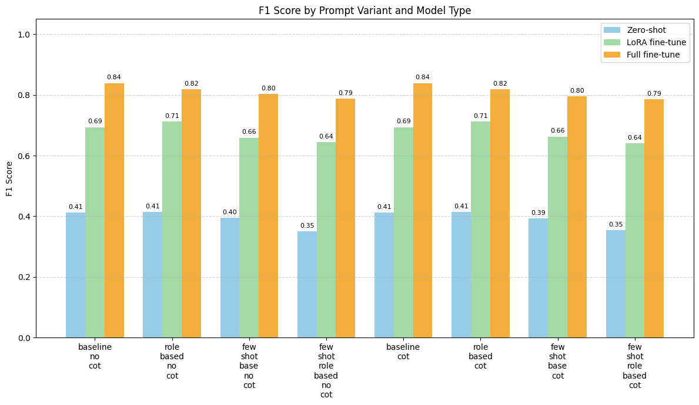

# Tweet Stance Classification for COVID-19 Vaccination

## Overview

The project implements stance classification on tweets related to COVID-19 vaccination, classifying them into three classes:
- **in-favor**: Tweets supporting vaccination.
- **against**: Tweets opposing vaccination.  
- **neutral-or-unclear**: Tweets with neutral or unclear stance.

We explore different fine-tuning approaches and prompt strategies to achieve a high F1-score performance.

## Dataset

The dataset we used is `Q2_20230202_majoritys.csv` in the `data` folder. The size of the dataset is 5751.
- **Preprocessing**: Removal of exact duplicates, and also null values.
- **Split**: 80% training, 20% evaluation (stratified)

## Project Structure

```
.
├── src/
│ ├── dataloader.py  # dataset class and tokenization
│ ├── model.py  # StanceClassifier wrapper
│ ├── train.py  # Finetuning script
│ ├── prompts.py # Get different prompts
│ └── inference.py  # Prediction utilities
├── data/
│ └── Q2_20230202_majority.csv
├── notebooks/
│ ├── data_exploration.ipynb
│ └── evaluate.ipynb 
├── output/
│ ├── zeroshot/ # Zero-shot results
│ ├── lora/ # LoRA fine-tuning results
│ └── full_tune/ # Full fine-tuning results
├── model/ # for storing the model
├── run_all_experiment.sh # Run prediction for all prompt strategies for a single model type
├── run_inference.sh # Run a single prediction for a single prompt strategy
├── finetune.sh # Run finetuning
├── token_analysis.py # find max length for label
├── requirements.txt
└── README.md
```

## Quick Start

### Installation

1. Clone the repository

```bash
git clone https://github.com/tianyi0216/Tweets_Classification.git
cd Tweets_Classification
```

2. Create virtual environment

```bash
python -m venv tweet-classification
source tweet-classification/bin/activate
```

3. Install dependencies

```bash
pip install -r requirements.txt
```

### Finetuning

```bash
# Full fine-tuning (recommended for best accuracy)
./finetune.sh baseline 8 8 2e-5 ./model/full_finetuned false

# LoRA fine-tuning (faster, resource-efficient)
./finetune.sh baseline 16 16 1e-4 ./model/lora_finetuned true   

# Parameters: [prompt_type] [batch_size] [learning_rate] [output_dir] [use_lora]
```

The rest of the hyperparameters are set in the `finetune.sh` file and `train.py`. You can modify them for other experiments.

### Inference

To generate a prediction file for a single experiment, you can run the following command:

```bash
# Run inference for a single prompt strategy
./run_inference.sh baseline 16 false google/flan-t5-large

# Parameters: [prompt_type] [batch_size] [cot] [model_name]
```

To generate prediction files for all prompt strategies, you can run the following command:

```bash
./run_all_experiment.sh
```

The output would be the original dataset with an additional column `prediction` for the predicted stance.

By default, the output would be saved in the `output` folder with subfolders for different model types. You can modify the `run_inference.sh` file to change the output directory.

Note: If running with a finetuned LoRA model, make sure to set the `model_name` to `google/flan-t5-large` in the `run_inference.sh` file. It works best given it is finetuned from the original model.

### Evaluation

We provide a notebook for evaluation in the `notebooks/evaluate.ipynb`. 

The notebook compares different prompt strategies and model types based on F1-score with some plots for visualization.

You can run or modify the notebook to get the performance of the model. 

## Model & Approaches

### Base Model
- **FLAN-T5-Large** 

### Fine-tuning Methods

1. **Zero-shot Learning**: Direct prompting without any parameter updates
2. **LoRA (Low-Rank Adaptation)**: Parameter-efficient fine-tuning. Target modules: Query, Key, Value, Output projections.
3. **Full Fine-tuning**: Fine-tuning the entire model (all parameters updated)

### Prompting Strategies

- **Baseline**: Simple classification prompt
- **Role-based**: Expert persona prompting  
- **Few-shot**: Provide one example for each class
- **Chain-of-Thought**: Addition of reasoning steps to the prompt

### Weights for finetuned models

We provide the weights for the fully finetuned model and the LoRA finetuned model [here](https://drive.google.com/drive/folders/1hSrneeJ2Fg86qUQ7_VOQzL6Ig3ZrfuDk?usp=sharing). 

## Results

Below is a figure from the notebook for visualization of the results.



The best model is the full fine-tuned model with the `baseline` prompt strategy that achieves a F1-score of 0.84 and accuracy of 0.87.


### Training Configuration for the best model

```python
# optimal hyperparameters for full fine-tuning
learning_rate: 2e-5
batch_size: 8
epochs: 15
```

Other arguments are the same as the ones in the `finetune.sh` file and `train.py`.